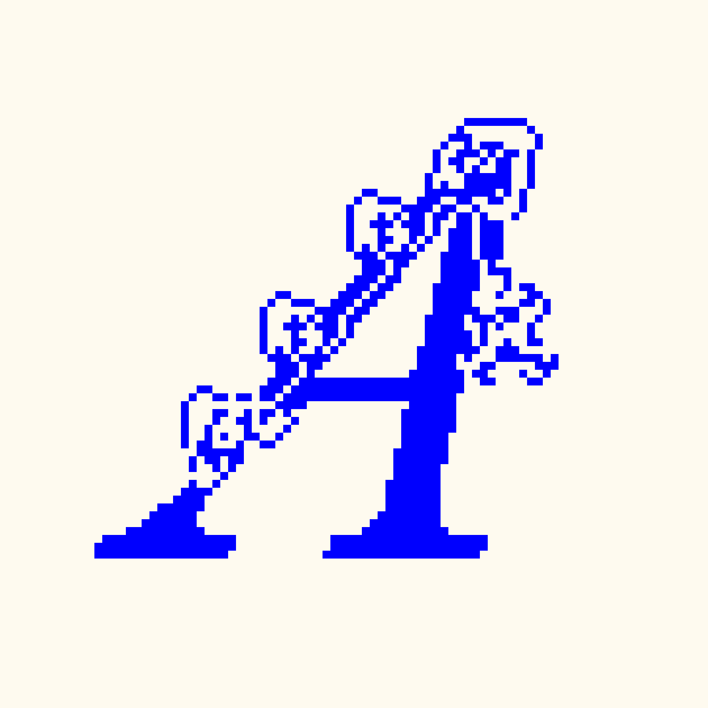
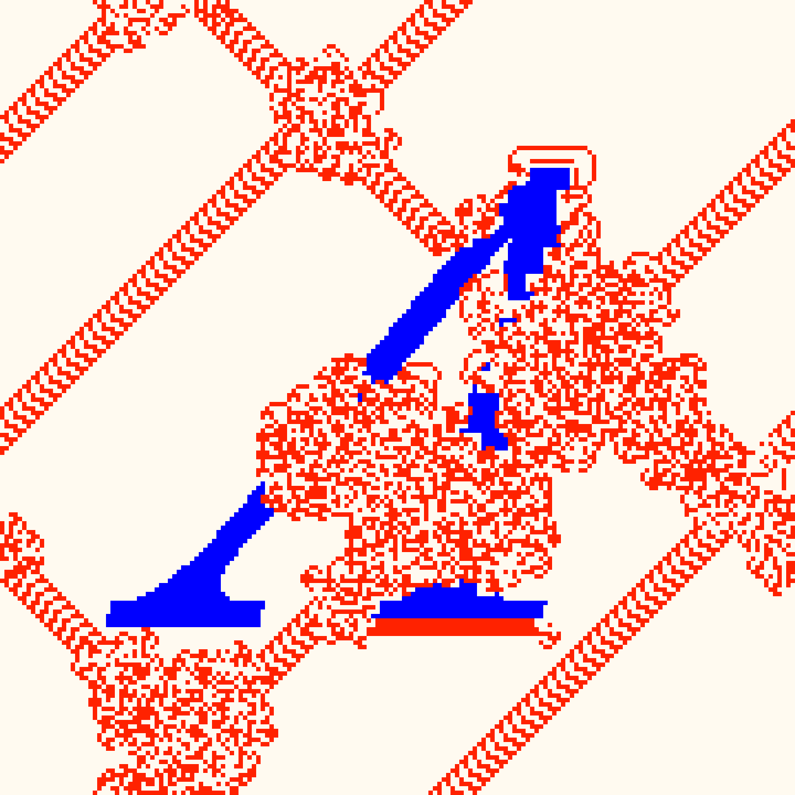

# Antype

A typographic automaton. Type a letter. Watch it dissolve.

---

Langton's Ant is a two-state cellular automaton with two rules:

- On a **white cell** — turn right, flip the cell black, move forward
- On a **black cell** — turn left, flip the cell white, move forward

That's it. From those two rules, chaos emerges — and then, inevitably, order: the ant locks into a diagonal highway and repeats forever.

Here, the grid is seeded with a letterform. The ant starts somewhere inside it. The letter is the terrain.

---

**Controls**

| Key                 | Action                   |
| ------------------- | ------------------------ |
| Any letter or digit | Set the seed glyph       |
| `Space`             | Play / pause             |
| `→`                 | Step forward when paused |
| `←`                 | Step back when pause     |
| `/`                 | Save high-res PNG        |

---

Built with [p5.js](https://p5js.org) and [Libre Baskerville](https://fonts.google.com/specimen/Libre+Baskerville).
